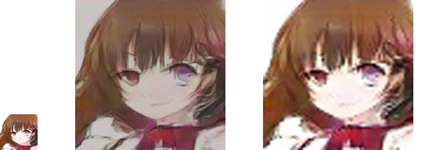

# Keras SRGAN
Implementation of SRGAN(Photo-Realistic Single Image Super-Resolution Using a Generative Adversarial Network) with keras.

Paper: [here](https://arxiv.org/abs/1609.04802)

# Result

Left image size: 64x64(I got this image from my implementation of [DRAGAN-keras](https://github.com/jjonak09/DRAGAN-keras))

Center image size: 256x256(SRGAN result)

Right image size: 256x256 (Bicubic補間)

- Batch size: 4
- This is 60000epochs (It takes 23 hours to get this result with GTX 1060)

## Environment
- OS: Windows 10
- CPU: Intel(R) Core(TM)i7-8700
- GPU: NVIDIA GTX1060 6GB
- RAM: 16GB
